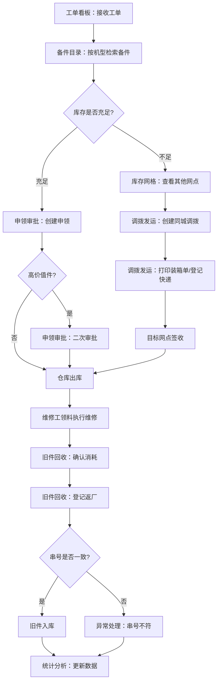

## 1. 产品概述

面向家电售后服务商的备件供应链管理桌面客户端，旨在打通工单→备件→库存→物流→回收的全链路闭环，提升一次修复率、降低缺件停工和库存占用成本。目标用户为售后服务坐席、仓库管理员和运营管理层。

## 2. 核心功能

### 2.1 用户角色

| 角色 | 进入方式 | 核心权限 |
|------|----------|----------|
| 坐席 | 系统账号登录 | 检索备件、创建申领、预约领料、查看库存、创建调拨、登记回收 |
| 仓库管理员 | 系统账号登录 | 审批申领、安排发运、打印装箱单、登记快递号、确认消耗 |
| 管理层 | 系统账号登录 | 查看统计分析、处理报废申请、查看安全线预警 |

### 2.2 功能模块

1. **工单看板**：工单状态总览、待处理工单、紧急工单标识、工单关联备件查看
2. **备件目录**：按机型检索备件、备件详情（兼容机型、替代件）、可用库存查询
3. **库存网格**：多网点库存热力图、安全线预警、库存明细查看、库存调拨入口
4. **申领审批**：创建申领（含紧急申领）、高价值件审批流、领料预约、缺件替代处理
5. **调拨发运**：同城调拨、装箱清单打印、快递单号登记、发运状态追踪
6. **旧件回收**：维修消耗确认、旧件返厂登记、超期未还预警、串号不符处理、报废申请
7. **统计分析**：按区域/品牌/故障类型分析备件周转率、一次修复率、库存占用

### 2.3 页面详情

| 页面名称 | 模块名称 | 功能描述 |
|----------|----------|----------|
| 工单看板 | 工单状态卡片 | 按待处理/进行中/已完成/紧急分组展示工单数量，点击可展开工单列表 |
| 工单看板 | 工单列表 | 展开工单详情：工单号、客户信息、机型、故障描述、关联备件、维修工信息 |
| 工单看板 | 紧急工单面板 | 红色高亮紧急工单，支持一键跳转申领或调拨 |
| 备件目录 | 机型检索 | 输入机型型号/品牌筛选，显示该机型所有可用备件 |
| 备件目录 | 备件列表 | 展示备件编号、名称、规格、兼容机型、库存数量、安全库存线 |
| 备件目录 | 备件详情侧滑 | 展示备件详细信息、替代件推荐、各网点库存分布、近期消耗趋势 |
| 备件目录 | 领料预约 | 选择备件后为维修工预约领料时间与网点 |
| 库存网格 | 网点库存热力图 | 网格化展示各网点库存水平，颜色深浅表示库存充裕程度 |
| 库存网格 | 安全线预警 | 低于安全线的备件标红预警，支持一键触发补货申领 |
| 库存网格 | 库存明细 | 选择网点后查看该网点所有备件的库存数量、在途数量、安全线 |
| 申领审批 | 申领列表 | 按状态（待审批/已批准/已驳回/已出库）筛选申领单 |
| 申领审批 | 创建申领 | 填写备件、数量、维修工、工单号，可标记紧急申领 |
| 申领审批 | 高价值件审批 | 金额超过阈值的备件需二次审批，显示价格和审批意见 |
| 申领审批 | 缺件替代 | 当备件缺货时，推荐替代件并确认替代方案 |
| 调拨发运 | 调拨单列表 | 查看所有调拨单及其状态（待发运/运输中/已签收） |
| 调拨发运 | 创建同城调拨 | 选择源网点、目标网点、备件和数量，创建调拨单 |
| 调拨发运 | 装箱清单 | 调拨单详情中打印装箱清单，包含备件明细和数量 |
| 调拨发运 | 快递登记 | 录入快递公司和单号，更新发运状态 |
| 旧件回收 | 回收单列表 | 查看回收单状态（待确认/已登记/运输中/已入库/异常） |
| 旧件回收 | 维修消耗确认 | 确认维修工实际消耗的备件及数量 |
| 旧件回收 | 旧件返厂登记 | 录入旧件信息、快递单号、返厂日期 |
| 旧件回收 | 异常处理 | 处理超期未还（催还提醒）、串号不符（核实登记）、报废申请（审批流） |
| 统计分析 | 备件周转分析 | 按时间维度展示备件周转率，支持按区域/品牌筛选 |
| 统计分析 | 一次修复率 | 按品牌/故障类型统计一次修复率趋势 |
| 统计分析 | 库存占用分析 | 按区域/品类展示库存金额分布和趋势 |
| 统计分析 | 自定义报表 | 选择维度和指标生成自定义分析报表 |

## 3. 核心流程

### 3.1 备件申领流程
坐席在工单看板发现待处理工单 → 按机型在备件目录检索可用备件 → 创建申领单（紧急申领可加急） → 高价值件进入审批流 → 审批通过后安排出库 → 维修工领取备件执行维修

### 3.2 同城调拨流程
坐席发现目标网点缺件 → 在库存网格查看其他网点库存 → 创建同城调拨单 → 安排发运并打印装箱清单 → 登记快递单号 → 目标网点签收确认

### 3.3 旧件回收流程
维修工完成维修 → 确认维修消耗 → 登记旧件返厂信息 → 系统检查串号 → 串号不符则进入异常处理 → 旧件入库或报废

## 4. 用户界面设计

### 4.1 设计风格
- **主色调**：深蓝灰 (#1E293B) 搭配科技蓝 (#3B82F6) 作为强调色，传达专业可信赖的工业感
- **辅助色**：琥珀色 (#F59E0B) 用于预警/紧急状态，翠绿色 (#10B981) 用于完成/正常状态，红色 (#EF4444) 用于异常/危险状态
- **按钮风格**：圆角微弧 (rounded-lg)，主要操作用实心按钮，次要操作用描边按钮
- **字体**：标题使用思源黑体/Source Han Sans，正文使用系统默认无衬线字体
- **布局风格**：左侧固定导航栏 + 右侧内容区，卡片式布局，表格为主的数据展示
- **图标风格**：使用 Lucide 线性图标，与整体简洁风格统一

### 4.2 页面设计概览

| 页面名称 | 模块名称 | UI元素 |
|----------|----------|--------|
| 工单看板 | 状态卡片 | 四列卡片（待处理/进行中/已完成/紧急），深色卡片背景，数字大号加粗，趋势箭头图标 |
| 工单看板 | 工单列表 | 表格布局，紧急行红色左边框，状态标签彩色胶囊，行点击展开详情 |
| 备件目录 | 检索区 | 顶部搜索栏+品牌/机型下拉筛选，搜索图标高亮 |
| 备件目录 | 备件列表 | 虚拟滚动表格，库存低于安全线行标红，点击行右侧滑出详情面板 |
| 备件目录 | 详情侧滑 | 右侧抽屉面板，替代件标签页，各网点库存柱状图 |
| 库存网格 | 热力图 | 网格矩阵，行=备件，列=网点，单元格颜色深浅表示库存水平，悬浮提示详细数据 |
| 库存网格 | 预警面板 | 右侧固定面板，预警项按严重程度排序，每项显示备件名、当前量/安全线 |
| 申领审批 | 申领列表 | 左侧列表+右侧详情，状态Tab切换，高价值件金色徽章 |
| 申领审批 | 创建表单 | 模态框表单，备件选择支持搜索，紧急开关红色醒目 |
| 调拨发运 | 调拨列表 | 表格+状态进度条，源→目标网点用箭头图标连接 |
| 调拨发运 | 装箱清单 | 打印预览模态框，表格带边框线，网点信息抬头 |
| 旧件回收 | 回收列表 | 表格布局，异常行琥珀色背景，串号不符红色标签 |
| 旧件回收 | 异常处理 | 侧滑面板，超期未还显示天数倒计时，报废申请需填写原因 |
| 统计分析 | 图表区 | 多Tab布局（周转/修复率/占用），折线图+柱状图组合，顶部维度筛选器 |

### 4.3 响应式设计
- 桌面优先设计，目标分辨率 1920×1080 及以上
- 最小支持 1366×768，内容区自适应宽度
- 侧滑面板和模态框在小屏幕下全屏展示

### 4.4 动效设计
- 页面切换：淡入淡出 (fade) 200ms
- 卡片悬浮：微上浮 + 阴影加深
- 列表加载：骨架屏占位
- 状态变更：数字变化用过渡动画
- 预警闪烁：低安全库存预警项缓慢脉冲动画
