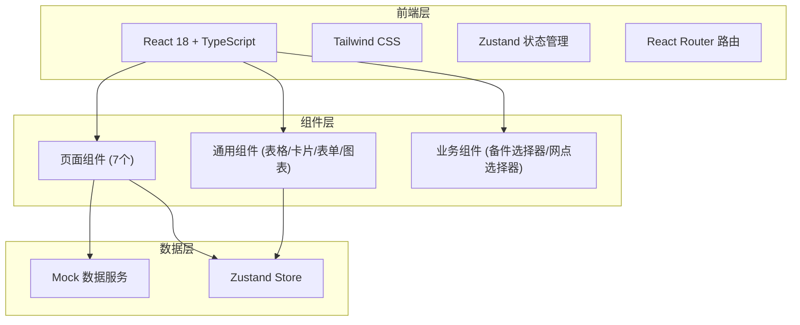

## 1. 架构设计



## 2. 技术说明

- **前端框架**：React 18 + TypeScript
- **样式方案**：Tailwind CSS 3
- **构建工具**：Vite
- **状态管理**：Zustand
- **路由方案**：React Router DOM v6
- **图表库**：Recharts
- **图标库**：Lucide React
- **后端**：无（纯前端，使用 Mock 数据）
- **初始化工具**：vite-init（react-ts 模板）

## 3. 路由定义

| 路由 | 用途 |
|------|------|
| `/` | 重定向到工单看板 |
| `/workboard` | 工单看板 - 工单状态总览与管理 |
| `/catalog` | 备件目录 - 按机型检索备件、领料预约 |
| `/inventory` | 库存网格 - 网点库存热力图与安全线预警 |
| `/requisition` | 申领审批 - 申领单创建与审批 |
| `/transfer` | 调拨发运 - 同城调拨与发运管理 |
| `/recovery` | 旧件回收 - 消耗确认与返厂登记 |
| `/analytics` | 统计分析 - 备件周转/修复率/库存占用 |

## 4. 数据模型

### 4.1 数据模型定义

```mermaid
erDiagram
    "WorkOrder" ||--o{ "OrderSparePart" : "contains"
    "SparePart" ||--o{ "OrderSparePart" : "referenced"
    "SparePart" ||--o{ "InventoryItem" : "has"
    "Warehouse" ||--o{ "InventoryItem" : "stores"
    "Requisition" ||--o{ "RequisitionItem" : "contains"
    "RequisitionItem" }o--|| "SparePart" : "requests"
    "Transfer" ||--o{ "TransferItem" : "contains"
    "TransferItem" }o--|| "SparePart" : "transfers"
    "Recovery" }o--|| "SparePart" : "returns"
    "Recovery" }o--|| "WorkOrder" : "belongs_to"

    "WorkOrder" {
        string "id PK"
        string "customer_name"
        string "machine_model"
        string "fault_desc"
        string "status"
        boolean "urgent"
        string "technician"
        date "created_at"
    }

    "SparePart" {
        string "id PK"
        string "part_no"
        string "name"
        string "spec"
        string "brand"
        string "compatible_models"
        number "unit_price"
        number "safety_stock"
        boolean "high_value"
        string "substitute_ids"
    }

    "Warehouse" {
        string "id PK"
        string "name"
        string "region"
        string "address"
    }

    "InventoryItem" {
        string "id PK"
        string "part_id FK"
        string "warehouse_id FK"
        number "quantity"
        number "in_transit"
        number "safety_line"
    }

    "Requisition" {
        string "id PK"
        string "work_order_id"
        string "applicant"
        string "status"
        boolean "urgent"
        boolean "needs_approval"
        string "approver"
        date "created_at"
    }

    "RequisitionItem" {
        string "id PK"
        string "requisition_id FK"
        string "part_id FK"
        number "quantity"
        boolean "substituted"
        string "original_part_id"
    }

    "Transfer" {
        string "id PK"
        string "from_warehouse_id FK"
        string "to_warehouse_id FK"
        string "status"
        string "courier"
        string "tracking_no"
        date "created_at"
    }

    "TransferItem" {
        string "id PK"
        string "transfer_id FK"
        string "part_id FK"
        number "quantity"
    }

    "Recovery" {
        string "id PK"
        string "work_order_id FK"
        string "part_id FK"
        string "status"
        string "serial_no"
        boolean "serial_mismatch"
        string "courier"
        string "tracking_no"
        date "return_date"
        string "disposal"
    }
```

### 4.2 Mock 数据策略

所有数据使用前端 Mock 生成，存储在 Zustand store 中：
- 预置 5 个网点数据
- 预置 50+ 条备件数据（涵盖空调、冰箱、洗衣机等品类）
- 预置 30+ 条工单数据（含各种状态）
- 预置 20+ 条申领/调拨/回收单据
- 所有写操作（创建申领、审批等）在前端内存中完成
